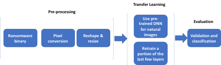

# Ransomware Detection & Identification Using AI
Updated 12-11-2020

# Abstract

Malware is a constantly evolving and rising threat, especially ransomware, a form of malware. The rise of ransomware as a service platform adds to this surge, and malware researchers need options to swiftly and reliably identify a family of ransomware to protect the data of individuals and vital infrastructures.

In this study we provide an image-based detection and classification method that can aid researchers in identifying the origins of ransomware by comparing it to known ransomware families. We aimed to reach a high level of accuracy and a low false positive rate on a given ransomware sample using a limited-size training dataset and COTS hardware.

We used a dataset of 347,307 Windows executable malware samples obtained from VirusTotal (VT). These samples were collected by VT between 2017 and 2020. From this dataset we selected samples positively identified as known ransomware.

We applied a novel AI-driven approach to classify ransomware based on an image representation of the binary file. This approach has been used by security practitioners and academics on malware in general but not on particular types of malware like ransomware.

We used a naïve approach to selecting the best-performing convolutional neural networks based on 16 of the available applications in Keras, a Python API for the TensorFlow opensource machine learning platform. These applications were pre-trained on the ImageNet dataset of natural images.

The proposed method achieves above 90% accuracy and a high recall rate for a high probability of detection of ransomware based on three channel (RGB) images. The best-scoring models on our dataset were MobileNet and MobileNetV2.

# Ransomware Detection & Identification Using AI

## Aim and objectives
The purpose of this research is to (1) contribute to existing knowledge in the field of identifying unknown ransomware using AI and (2) propose a practical model that can be used by malware analysts when detecting and initially identifying ransomware. We aim to achieve a high level of accuracy and a low false positive rate in identifying ransomware and classifying a given sample into a known ransomware family.

## How can deep learning be used to detect and identify ransomware?

To answer the main research question, two theoretical and an empirical sub-question have been formulated:

1.	What are the current methods for detecting and identifying ransomware?
2.	What is deep learning and deep transfer learning?
3. a.	How can a pre-trained model be implemented for detecting and identifying ransomware?
   b.	How effective is this implemented model?

## The proposed method consists of the following basic steps:
1) Given a dataset of labeled ransomware Windows executables, convert each sample to its respective byteplot RGB image;
2) Reshape and resize it to a 112 × 112 dimension and subtracting the mean RGB value from each pixel and to feed it to the deep neural network;
3) Build a deep convolutional neural network (DCNN) based on the different architectures,
4) We fine tune the DCNN:
- replacing the last 1000 fully-connected softmax layer by a 8 fully-connected softmax layer as classifier;
- adding global for feature extraction;
- adding dense layer with 1024 neurons relu layer for feature extraction;
- transferring the parameters of architecture convolutional layers to the convolutional layers of the DCNN models;
5) Freeze the transferred convolutional layer’s parameters and train the DCNN model to classify each sample into its ransomware family.

An overview of the approach is shown below.

## Setup
We use python virtual environments (pipevn) to import and configure the necessary software libraries.
To create an environment run: \
pipenv install -r requirements.txt \
Please consult https://pypi.org/project/pipenv/ how to use.

## Parsing, prepocessing and processing
Before using the 'proposed_approach.ipynb' in the notebooks folder (used in chapter 4 of the thesis) use the (pre-)processing scripts in the 'preprocessing' folder.

The dataset folder must contain a: interim, processed and preprocessed sub-folder.

This is a list of all scripts used in order of use:
1) parse.py
2) binar2image.py - on the interim folder (see https://github.com/ncarkaci/binary-to-image)
3) imagesize.py - calculate image sizes by converted binaries
4) preprocess.py distribute - distributes data to folders
5) process.py - generates trainset.plk and testset.plk

To collect the samples from the a Windows 10 Operating system use the script as provided in the windows folder. The SHA1 hash of the Windows 10 image file used is listed below:
6309664dc8aa8a2f5699abeb47b12d0c6368a66f  Win10_2004_EnglishInternational_x32.iso

## Experiment
Run the experiment by using the files in de 'compare-dnn' folder and reset the folder paths in the scripts to match the new environment and execute the runner.sh script.
The 'evaluate_models.ipynb' notebook in notebooks folder is used to evaluate the models performance during training, validation and testing.

## Experimental results
Use the 'expertimental_results.ipynb' (Chapter 6 of the thesis) in the notebooks folder.

## Conclusions
- Current methodes for detecting and identifying ransomware and malware in general are based on static, image based and dynamic analysis techniques.
- It is possible to apply deep transfer learning e.g. pre-trained CNN's.
- The MobileNet (V1 and V2) CNN's score an above 90% accuracy on a dataset of Windows PE files.

## Prototype detector
As described in Appendix 3 we provided a working implementation of the MobileNetV1 and MobileNetV2 models in a detector. The script can be found in the 'detector' folder of this repository.
The detector can be used running the commands listed below:
python detector.py -m MobileNetV1 testimage.png
python detector.py -m MobileNetV2 testimage.png
## Acknowledgements
We gratefully acknowledge the support of [VirusTotal](https://www.virustotal.com)for providing the malware samples used in this research.
